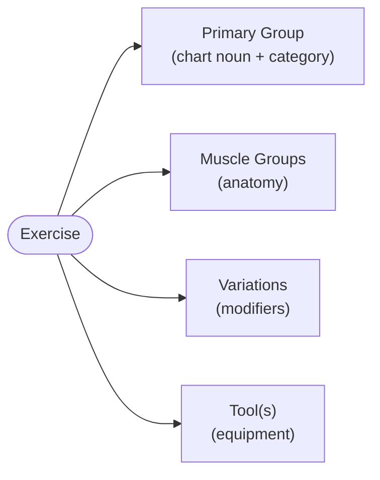

# New User Seeds (rev. 3 — LOCKED)

> **Status:** Rev. 3 **LOCKED**. Canonical catalog for what a new account inherits
> (PGs + category, lean Variations seed, muscles, tools, nest labels). Product
> term for the tag slot is **Variations** (DB table remains `analytics_tags`).
> Shorter seed map: [`Label_Library.md`](./Label_Library.md). Still parked:
> seed SQL content dump, starter templates, in-app user guide. Set-row
> `intensity` / `set_type` columns ship in `sql/greenfield/`; UI + denest are
> chat 5.
>
> Decision rules: [`Label_Library.md`](./Label_Library.md),
> [`Analytics_Labeling.md`](./Analytics_Labeling.md).

Audience served by one shared library: calisthenics / hybrid / martial-arts
athletes, the average gym-goer, bodybuilders, runners, CrossFitters, fighters,
and total beginners — across **fitness, wellness, and sport**.

---

## Model at a glance

Four axes describe every exercise. Each does exactly one job, so nothing is
double-encoded:

- **Primary Group** = the chart noun volume accrues to; carries a **`category`**
  (Push / Pull / Lower / Core / Power / Skill / Cardio / Combat / Mobility /
  Wellness) that powers balance analytics automatically.
- **Muscle groups** = anatomy (14 seeded defaults).
- **Variations = modifiers only** — what turns a PG into a specific exercise
  (grip, angle, named variant, execution, load, discipline, cardio flavor).
  Flat rows in `analytics_tags`, **spelled once**. Redundant facets removed
  (pattern, plane, coarse region) because PG + category + muscles already encode
  them.
- **Tool(s) = equipment** (`No Tool` = bodyweight). **Equipment is never also a
  variation** — a dumbbell curl is PG `Curls` + Tool `Dumbbell(s)`, not a
  `Dumbbell` variation.
- **Set-row fields** (Intensity, set type) are proposed separately — see the
  design note at the end.

**Example:** *Weighted Wide-Grip Pullups* → PG `Pullups` (category **Pull**) ·
Muscles Lats / Biceps / Forearms · Variations `Wide-Grip`, `Weighted` · Tools
Straight Bar + Weight Belt · Set: Working @ Intensity 8.

## Naming conventions

- Discrete movements = plural noun (`Pushups`, `Rows`, `Curls`); pressing stays
  singular (`Bench Press`, `Overhead Press`).
- Family PGs use an umbrella noun, flavor = variation: `Gait`, `Jumps`, cardio
  gerunds `Rowing` / `Swimming` / `Cycling`.
- Combat = mode phrase (`Drilling`, `Live Sparring`, `Competition Fights`);
  discipline = variation.
- Variation names read like plain English (`Goblet`, `Sumo`, `Archer`,
  `Running`, `Box`).

---

# Primary Group catalog

Each PG lists its **category** (section), **default muscle groups** (0–N), and
**suggested variations**. Cardio / combat / mobility / wellness default to no
muscles (`—`). Suggested variations are **movement/execution variations only** —
equipment lives in Tools. `(new)` marks PGs added in rev. 3.

> **Seed note:** only the **shared / high-reuse** variations (see Variations
> section) are seeded as default `analytics_tags`. PG-specific names shown here
> (`Goblet`, `Pendlay`, `Nordic`, `Farmer`, …) are **suggestion-only** — created
> on first use or via later templates, not seeded up front.

## Category: Push

| Primary group | Default muscles | Suggested variations |
|---------------|-----------------|----------------------|
| **Bench Press** | Chest, Triceps, Shoulders | Flat, Incline, Decline, Close-Grip, Paused, Floor |
| **Chest Flys** *(new)* | Chest, Shoulders | Flat, Incline, Single-Arm |
| **Dips** | Chest, Triceps, Shoulders | Standard, Weighted, Assisted |
| **Lateral Raises** | Shoulders | Standard, Leaning, Single-Arm, Paused |
| **Overhead Press** | Shoulders, Triceps, Traps | Standard, Push-Press, Seated, Arnold, Handstand, Single-Arm |
| **Pushups** | Chest, Triceps, Shoulders, Core | Standard, Wide, Diamond, Decline, Incline, Archer, Explosive, Pike, Weighted |
| **Triceps Extensions** | Triceps | Overhead, Skullcrusher, Rope, Single-Arm |

## Category: Pull

| Primary group | Default muscles | Suggested variations |
|---------------|-----------------|----------------------|
| **Curls** | Biceps, Forearms | Standard, Hammer, Preacher, Incline, Concentration, Reverse-Grip |
| **Deadhangs** | Forearms, Lats | Standard, Wide-Grip, Weighted, Single-Arm, Towel |
| **Face Pulls** | Rear Delts, Traps | Seated, Standing, Single-Arm |
| **Pulldowns** | Lats, Biceps | Wide-Grip, Narrow-Grip, Neutral-Grip, Reverse-Grip, Single-Arm |
| **Pullups** | Lats, Biceps, Forearms | Standard, Wide-Grip, Narrow-Grip, Neutral-Grip, Chin-Up, Archer, Explosive, Kipping, L-Sit, Weighted, Assisted |
| **Rows** | Lats, Rear Delts, Biceps, Traps | Pendlay, Bent-Over, Chest-Supported, Inverted, Underhand, Single-Arm |
| **Shrugs** *(new)* | Traps | Standard, Behind-Back, Snatch-Grip |

## Category: Lower

| Primary group | Default muscles | Suggested variations |
|---------------|-----------------|----------------------|
| **Back Extensions** *(new)* | Hamstrings/Glutes, Spinal Chain | Standard, Weighted, Single-Leg, 45-Degree |
| **Calf Raises** | Calves | Standing, Seated, Single-Leg, Weighted |
| **Deadlifts** | Hamstrings/Glutes, Spinal Chain, Quads, Forearms, Traps | Conventional, Sumo, Romanian, Stiff-Leg, Deficit, Paused, Single-Leg |
| **Hip Thrusts** | Hamstrings/Glutes | Standard, Single-Leg, Banded, Bodyweight |
| **Leg Curls** | Hamstrings/Glutes | Seated, Lying, Standing, Nordic |
| **Leg Extensions** | Quads | Standard, Single-Leg, Paused |
| **Lunges** | Quads, Hamstrings/Glutes, Calves | Forward, Reverse, Lateral, Walking, Alternating, Jumping, Curtsy, Bulgarian, Weighted |
| **Squats** | Quads, Hamstrings/Glutes, Core | Back, Front, Goblet, Overhead, Hack, Box, Paused, Bulgarian, Offset, Barbarian |

## Category: Core

| Primary group | Default muscles | Suggested variations |
|---------------|-----------------|----------------------|
| **Core Work** | Core, Spinal Chain | Plank, Sit-Up, Crunch, Leg-Raise, Hanging-Leg-Raise, Russian-Twist, Rollout, Hollow-Hold, Woodchopper, Weighted |

## Category: Power

| Primary group | Default muscles | Suggested variations |
|---------------|-----------------|----------------------|
| **Cleans** | Hamstrings/Glutes, Quads, Traps, Shoulders, Spinal Chain | Power, Hang, Squat, Muscle, Single-Arm |
| **Jumps** | Quads, Calves, Hamstrings/Glutes | Box, Broad, Tuck, Depth, Bounding, Standard, Jump-Rope, Bouncing, Weighted |
| **Snatches** | Hamstrings/Glutes, Quads, Shoulders, Traps, Spinal Chain | Power, Hang, Squat, Single-Arm |
| **Swings** | Hamstrings/Glutes, Core, Shoulders | American, Russian, Single-Arm |

## Category: Skill / Implement

| Primary group | Default muscles | Suggested variations |
|---------------|-----------------|----------------------|
| **360s** | Core, Shoulders, Spinal Chain | Single, Double, Switch |
| **Carries** | Forearms, Traps, Core | Farmer, Suitcase, Overhead, Front-Rack |
| **Halos** | Shoulders, Core, Traps | Standard, Kneeling |
| **Handstands** *(new)* | Shoulders, Core, Triceps | Wall, Freestanding, Hold, HSPU, Walk |
| **Muscle-Ups** *(new)* | Lats, Chest, Triceps, Biceps, Core | Kipping, Strict, Assisted |

## Category: Cardio / Conditioning

| Primary group | Default muscles | Suggested variations |
|---------------|-----------------|----------------------|
| **Burpees** *(new)* | — | Standard, Chest-to-Floor, Box-Jump, Half |
| **Cycling** | — | Road, Mountain, Intervals, Steady, Easy |
| **Gait** | — | Walking, Running, Sprinting, Hiking, Rucking, Trail, Intervals, Steady, Easy |
| **Rowing** | — | Intervals, Steady, Easy |
| **Swimming** | — | Freestyle, Breaststroke, Backstroke, Drill, Intervals, Easy |

## Category: Combat

| Primary group | Default muscles | Suggested variations |
|---------------|-----------------|----------------------|
| **Competition Fights** | — | BJJ, Boxing, Judo, Kickboxing, MMA, Muay Thai, Wrestling |
| **Drilling** | — | BJJ, Boxing, Judo, Kickboxing, MMA, Muay Thai, Wrestling, Pads, Positional, Shadow |
| **Live Sparring** | — | BJJ, Boxing, Judo, Kickboxing, MMA, Muay Thai, Wrestling, Rolling, Rounds |

## Category: Mobility

| Primary group | Default muscles | Suggested variations |
|---------------|-----------------|----------------------|
| **Mobility** | — | Yoga, CARs, Dynamic, Movement-Prep |
| **Stretching** | — | Yoga, Static, Dynamic, PNF |

## Category: Wellness

| Primary group | Default muscles | Suggested variations |
|---------------|-----------------|----------------------|
| **Breathwork** | — | Box-Breathing, Wim-Hof, Guided |
| **Cold Exposure** | — | Plunge, Shower, Contrast |
| **Meditation** | — | Guided, Unguided, Breath-Focused |
| **Sauna** | — | Dry, Steam, Infrared, Contrast |

**43 PGs across 10 categories.**

---

# Variations (modifiers)

Flat `analytics_tags` rows, spelled once. Product UI calls this slot
**Variations**. Equipment is **never** a variation (it's a Tool). Two tiers: a
**seeded default set** (below) and **suggestion-only** names that appear in the
catalog but are created on first use.

## Seeded default variations *(shared / high-reuse)*

- **Grip / stance:** `Standard`, `Wide-Grip`, `Narrow-Grip`, `Neutral-Grip`,
  `Reverse-Grip`, `Close-Grip`, `Underhand`
- **Side / limb:** `Single-Arm`, `Single-Leg`, `Alternating`, `Offset`
- **Angle / position:** `Flat`, `Incline`, `Decline`, `Seated`, `Standing`,
  `Paused`
- **Execution:** `Explosive`, `Archer`, `Kipping`, `Strict`, `Hold`
- **Load:** `Weighted`, `Assisted`, `Banded`, `Bodyweight`
- **Orientation:** `Forward`, `Reverse`, `Lateral`
- **Gait flavor:** `Walking`, `Running`, `Sprinting`, `Hiking`, `Rucking`, `Trail`
- **Cardio intensity:** `Easy`, `Intervals`, `Steady`
- **Jumps flavor:** `Box`, `Broad`, `Tuck`, `Depth`, `Bounding`, `Bouncing`,
  `Jump-Rope`
- **Combat discipline:** `BJJ`, `Boxing`, `Judo`, `Kickboxing`, `MMA`,
  `Muay Thai`, `Wrestling`
- **Practice:** `Yoga`
- **Context (optional):** `Complex` (multi-PG complexes)

`Standard` is the universal "default variation" chip. **~60 seeded variations.**

## Suggestion-only *(created on first use — not seeded)*

The ~50 PG-specific movement names in the catalog (`Goblet`, `Pendlay`, `Sumo`,
`Romanian`, `Bulgarian`, `Barbarian`, `Hack`, `Hammer`, `Preacher`, `Diamond`,
`Pike`, `Skullcrusher`, `Rope`, `Woodchopper`, `Plank`, `Nordic`, `American`,
`Russian`, `Farmer`, `Freestyle`, `HSPU`, `Pads`, …). They read as suggestions
in the picker and become real rows the first time a user commits one.

## Removed from the default variation set

| Dropped | Why |
|---------|-----|
| `Push`, `Pull`, `Hinge` | Encoded by PG + **category**. |
| `Horizontal`, `Vertical`, `Transverse` | Plane encoded by PG. |
| `Full Body`, `Upper Body`, `Legs` | Duplicate muscle groups + category. |
| `Calisthenics` | Context, not a variation; implied by `No Tool`. |
| `Murph Challenge` | User-specific event → use the `Challenge` block label. |
| `Barbell`, `Dumbbell`, `Cable`, `Kettlebell`, `Machine`, `Ring`, `Band` | **Equipment → Tools**, never variations. |

> **Live-account caveat:** dropping the facet tags is for the **default seed
> only**. Do **not** wipe `Push` / `Pull` / etc. from existing accounts until
> **`category`** ships in schema + Insights. Docs-only deletion is fine now.

---

# Muscle groups *(unchanged — 14 seeded defaults)*

`Biceps`, `Calves`, `Chest`, `Core`, `Forearms`, `Hamstrings/Glutes`, `Lats`,
`Neck`, `Quads`, `Rear Delts`, `Shoulders`, `Spinal Chain`, `Traps`, `Triceps`.

---

# Tools

Global sentinel: **`No Tool`**. `(new)` = added in rev. 3. `(s)` marks
pluralizable implements. Equipment-style "variations" (dumbbell, barbell, cable,
trap-bar, EZ-bar, ring, machine) are represented **here**, not as Variations.

Ab Wheel · Barbell · Bench · Cable Machine · Club(s) · Dumbbell(s) ·
**EZ Bar** *(new)* · **Foam Roller** *(new)* · Gymnastic Rings · Jump Rope ·
Kettlebell(s) · Mace · **Machine** *(new)* · Medicine Ball · No Tool ·
Parallel Bars · Plyo Box · Pull-up Bar · Resistance Band(s) · Rowing Machine ·
Sandbag · Stationary Bike · Straight Bar · **Suspension Trainer (TRX)** *(new)* ·
Treadmill · Weight Belt · Weighted Vest.

**27 tools.**

---

# Nest labels *(unchanged from rev. 2)*

- **Session** (day intent) — null `Session`; `Cardio`, `Hybrid`,
  `Martial Arts`, `Mobility`, `Recovery`, `Recreation`, `Rest` (empty), `Strength`.
- **Block** (structure) — null `Block`; `Challenge`, `Class`, `Competition`,
  `Cooldown`, `Main` (was `Workout`), `Testing`, `Warmup`, `Wellness`.
- **Sequence** (nest) — null `Sequence`; `Circuit`, `Superset`.

---

# Design note: set-row fields (Intensity + set type) — future schema phase

Not part of this seed and no SQL yet — flagged because it's the highest-leverage
analytics upgrade and should be designed as one coherent unit.

## Intensity *(decided — set-row only)*

- **Where:** per **set-row** only. No session/exercise rollups and no e1RM math
  yet (revisit later). Opt-in via an **Intensity toggle in the More menu**
  (mirrors `track_analytics`).
- **Scale:** **0–10 in 0.5 steps.** `0 = clear/null` (not a real value); real
  values are `0.5`–`10.0`.
- **Storage:** UI `0` writes a true **`NULL`** — never persist literal `0`.
  Column `intensity` = nullable `numeric(3,1)` (or smallint half-points), CHECK
  0.5 increments within `0.5`–`10.0`. Keeps `AVG` / percentiles honest (nulls
  excluded, not dragged toward zero).
- **Legend:** no fixed legend in the input; the 0–10 anchors live in the future
  in-app user guide, not the field UI.
- **Name:** "Intensity" (universal across lifting / cardio / combat / wellness);
  "RPE" is just the gym framing.

## Other proposed per-set fields *(still ideating)*

| Field | Type | Purpose |
|-------|------|---------|
| **Set type** | enum: `Warmup`, `Working`, `Drop`, `Failure`, `AMRAP`, `Backoff` (default `Working`) | Count only real work in volume charts; exclude warmups. |
| **Rest** *(optional)* | seconds | Density / conditioning analytics. |
| **Tempo** *(optional)* | string (e.g. `3-1-1`) | Eccentric emphasis. |

## Analytics this unlocks

Immediate (from the raw set-row + category axes):

- **Sets-per-muscle-per-week** (working sets × muscle groups).
- **Tonnage** (Σ weight × reps).
- **Balance charts** — push vs pull, upper vs lower, strength vs conditioning —
  free from the PG **category** axis.

Later (once derived math / rollups are added — deferred for now):

- **Estimated 1RM (e1RM)** from weight × reps refined by intensity.
- **Session load** (intensity × duration/volume) and **ACWR** overtraining
  flags.

---

# Changelog

**Rev. 2 → Rev. 3**

| Change | Detail |
|--------|--------|
| Tags → Variations | Product term **Variations** (modifiers); DB `analytics_tags` unchanged until SQL rewrite. Facet folders → curated per-PG, flat + spelled once. |
| Facets deleted | `Push`/`Pull`/`Hinge`, planes, coarse region, `Calisthenics`, `Murph Challenge`. |
| Equipment un-tagged | `Barbell`/`Dumbbell`/`Cable`/`Kettlebell`/`Machine`/`Ring`/`Band` moved to Tools only (no dual-encoding). |
| Category promoted | Section groupings → first-class PG **`category`** attribute. |
| Lean seed rule | Seed ~60 shared/high-reuse variations; ~50 PG-specific names are suggestion-only. |
| PGs added | `Chest Flys`, `Shrugs`, `Back Extensions`, `Burpees`, `Handstands`, `Muscle-Ups` (now 43). |
| Tools added | `Machine`, `EZ Bar`, `Suspension Trainer (TRX)`, `Foam Roller` (now 27). |
| Nest label nits | Block `Workout` → `Main`; add `Wellness`; combat PG stays **`Competition Fights`** (plural). |
| Set-row note | Intensity / set-type design note; columns now in `sql/greenfield/007` (UI + denest = chat 5). |
| Doc sync | Mirrored into `Label_Library.md` + light `Analytics_Labeling.md` vocab. |

## Parked (out of scope until requested)

- Starter exercise templates (hyper-specific clones, e.g. *Cable Rope Skull
  Crushers* → `Triceps Extensions` + variation `Rope` + Tools Cable Machine).
- `ensure_default_*` seed **content** (implements the lean seed rule + `category`
  values; stubs already exist in `sql/greenfield/005`). Optional rename of
  `analytics_tags` table later.
- In-app user guide ("how OttoLog is meant to be used"), which houses the 0–10
  intensity legend and the taxonomy how-to.
- Chat 5 app work: denest/renest variations, `track_intensity` UI, Insights MVP.
